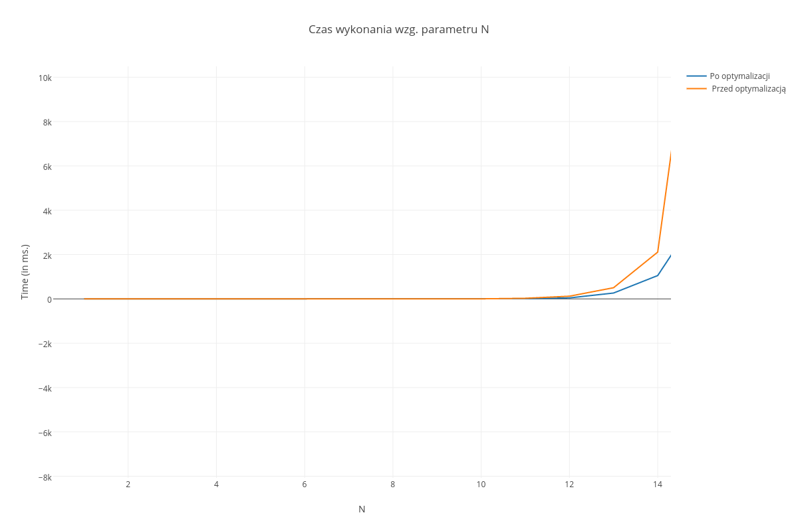
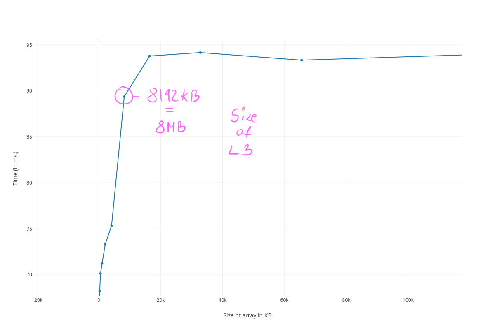

# Lista 11

## Zadanie 1

> Parametry wykonania: 1 <= n <= 20



__Wyniki przed optymalizacją:__

```bash
#N, TIME (in ms.)
1, 0.000000
2, 0.000120
3, 0.000040
4, 0.000280
5, 0.000800
6, 0.003400
7, 0.026040
8, 0.156280
9, 0.848360
10, 3.223840
11, 28.068880
12, 121.706800
13, 504.121440
14, 2110.482320
15, 16707.844560
```

\pagebreak

__Wyniki po optymalizacji:__

```bash
#N, TIME (in ms.)
1, 0.000080
2, 0.000120
3, 0.000280
4, 0.000480
5, 0.000800
6, 0.003600
7, 0.013640
8, 0.054080
9, 0.272200
10, 2.801680
11, 11.353560
12, 44.819280
13, 265.087920
14, 1052.628800
15, 4060.102680
```

## Zadanie 2

> Parametry wykonania: 1 <= n <= 8, s = 16, t = 14


\pagebreak

__Wyniki przed optymalizacją:__

```bash
#N, TIME (in ms.)
1, 5511.412800
2, 5521.016400
3, 5531.008400
4, 5520.402000
5, 5531.458800
6, 5514.235200
7, 5529.738000
8, 5537.474600
```


__Wyniki po optymalizacji:__

```bash
#N, TIME (in ms.)
1, 2914.231200
2, 2912.729400
3, 2909.339200
4, 2921.631600
5, 2927.495400
6, 2926.240400
7, 2914.669600
8, 2922.679400
```

## Zadanie 3

> Parametry wykonania: 1 <= n <= 20, t = 24


\pagebreak

__Wyniki przed optymalizacją:__

```bash
#N, TIME (in ms.)
1, 8.910079999999999
2, 12.205439999999998
3, 14.808239999999996
4, 20.376400000000004
5, 23.880880000000005
6, 26.22904
7, 33.74124
8, 39.21208
9, 42.106399999999994
10, 45.83776
11, 49.66144
12, 53.93324
13, 57.51800000000002
14, 65.40039999999999
15, 72.12888000000001
16, 82.16863999999998
17, 101.88636
18, 124.69131999999998
19, 143.81768000000005
20, 160.52724
```

```


```

__Wyniki po optymalizacji:__

```bash
#N, TIME (in ms.)
1, 7.527240000000001
2, 7.88224
3, 8.142920000000002
4, 8.41432
5, 9.09404
6, 9.19384
7, 9.27524
8, 10.17868
9, 11.373359999999998
10, 12.427960000000002
11, 13.836520000000005
12, 15.0592
13, 17.144999999999996
14, 19.43724
15, 22.63164
16, 26.84016
17, 35.38644000000001
18, 45.54924
19, 61.191599999999994
20, 80.69983999999998
```

\pagebreak

## Zadanie 4

__1. Długość linii__


> Aby wyznaczyć długość linii postanowiłem sprawdzić jak zmieniają się czasy dostępu do pamięci przy zmieniającym się interwale skoku z jednej komórki tablicy do kolejnej. W tym celu wygenerowałem 20 różnych wersji programu ( kawałek funkcji znajduje się niżej ) dla różnej długości skoków ( od 4 do 512 bajtów ). Następnie przy użyciu skryptu uruchomiłem tak spreparowane programy po 20 razy każdy i po uśrednieniu wyników wygenerowałem powyższy wykres. Jak można zauważyć, dla skoków od 4-32 bajtów czasy są dosyć podobne. Wynika to z tego, że w tych przypadkach udawało nam się jeszcze zmieścić w linii a zatem nie było potrzeby pobierania dodatkowych danych. Gdy jednak zaczeliśmy wykonywać skoki co 64 bajty ( zaznaczone na wykresie ), przestaliśmy trafiać w tą samą linie co też powodowało wydłużenie dostępów do pamięci, i tym samym, przedłużenie wykonania programu. Z tych informacji możemy więc wywnioskować iż długość linii pamięci w moim procesorze wynosi 64B.


```c
void generate_permutation(int *array, int size) {
#ifdef STEP
    int skip = (1 << STEP);
#else
    int skip = 16;
#endif
    int i;
    for (i = 0; i < size - skip; i += skip)
        array[ i ] = i + skip;

    array[ i - skip ] = -1;
}
```

\pagebreak

__2. Wielkości pamięci cache__


> W tym przypadku ponownie postanowiłem sprawdzić jak zmieniają się czasy dostępu, aczkolwiek w zależności od wielkości zaalokowanej pamięci. Tym razem ustalamy stały skok co 64 bajty ( długość linii ) i manipulując wielkością tablicy szukamy wielkości dla których możemy zaobserwować duże spadki wydajnościowe ( czyli takie przed którymi dostępy utrzymują się na relatywnie stałym pozomie i po których czas wykonania rośnie widocznie w górę ). Takich punktów na wykresie można wyznaczyć trzy i są to wielkości kolejno pamięci L1, L2 oraz L3.



