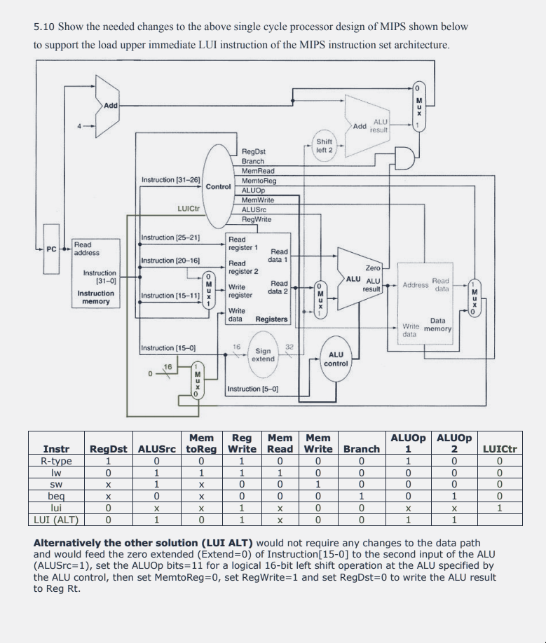
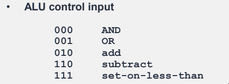
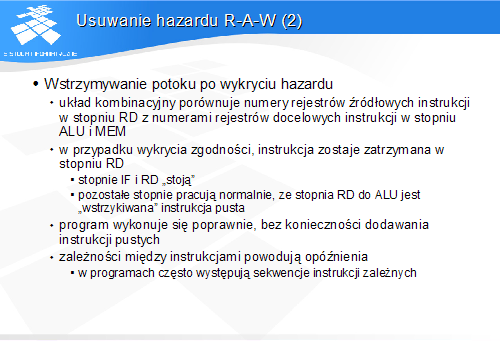

## Zadanie 1

1.

```
000000 SSSSS TTTTT DDDDD <<<<< FFFFFF
000000 SSSSS 00000 00000 00000 001000
```

2.

```
OOOOOO SSSSS TTTTT CCCCCCCCCCCCCCCC
001111 00000 TTTTT CCCCCCCCCCCCCCCC
```

3.

Dodatkowe ALU do dodania 4 oraz dodatkowe piny w Register File, Write2 i WriteData2. Ustalamy, że rejestr do którego wpisujemy wartość jest taki sam jak ReadRegister1 (A1)

## Inne






