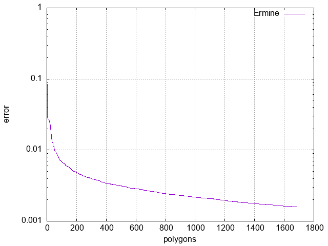

# Opis problemu

Tematem projektu była próba rekonstrukcji zadanych obrazów przy pomocy wielokątów, bez ograniczania maksymalnej liczby wielokątów składających się na dane przybliżenie (rekonstrukcję). Dla konkretnej, powiedzmy `i`-tej iteracji rozważamy dotychczas wygenerowany obraz (najlepszą rekonstrukcję) i próbujemy go poprawić dodając nowy losowy wielokąt. Następnie optymalizujemy dany wielokąt parametryzując go kolorem, przesunięciem, rotacją oraz wielkością ze względu na najlepsze poprawienie obrazu w obecnej iteracji. To pozwala nam ograniczyć przestrzeń poszukiwań do małej ilości parametrów, ponieważ ani nie bierzmy pod uwagę optymalizacji całego dotychczas wygenerowanego ciągu, ani też nie próbujemy optymalizować jak wygląda sam wielokąt. Dany wielokąt zostawiamy, jeżeli polepsza on nam najlepszą rekonstrukcję, i pomijamy jeżeli powoduje on pogorszenie obecnego wyniku. Funkcję kosztu definiujemy jako błąd kwadratowy pomiędzy pikselami oryginalnego obrazka oraz rekonstrukcji.

$$fitness(O, R) = \sum\limits_{1\leq j\leq W}\sum\limits_{1\leq i\leq H}\sum\limits_{1\leq c\leq 3} {(O_{ijc} - R_{ijc})}^2$$

Do samej optymalizacji pojedyńczych wielokątów został użyty algorytm $ES(\mu + \lambda)$.

W trakcie wykonywania projektu zostały rozważone jeszcze dwie inne funkcje kosztu, mianowicie `ilość różnych pikseli` oraz `precepcyjna różnica kolorów`, jednak obie z tych funkcji powodowały, że algorytm zbiegał zdecydowanie wolniej niż w przypadku podstawowej funkcji `fitness`, tym samym zostały porzucone.

# Implementacja

Każdy z wielokątów był optymalizowany używając $ES(\mu + \lambda)$ przy hiperparametrach $\mu = 30$, $\lambda = 15$, $k = 5$ oraz $200-300$ iteracjach. Nowo generowane dzieci, które nie należały do domeny były od razu filtrowane i nie były rozważane w dalszych iteracjach. Liczba iteracji została dobrana eksperymentalnie w taki sposób, aby ograniczyć czas, w którym algorytm nic nie robi. Takie podejście pozwala nam rozważyć dużą ilość zoptymalizowanych lokalnie wielokątów, które mogą nam globalnie poprawić rekonstrukcję obrazu.

# Wyniki

Jak można odczytać z wykresów, średnio po 100-200 wielokątach rekonstrukcje miały już co najmniej $90\%$ poprawności ze względu na naszą funkcję kosztu. W przypadku `Ermine`, na początku została zastosowana funkcja kosztu bazującej na percepcyjnej różnicy kolorów, a następnie po 200 wielokątach ponownie funkcja `fitness`. To, czego jednak nie pokazuje wykres to fakt, że dodanie pierwszych 200 wielokątów trwało mniej-więcej tyle samo co kolejnych 1200.

W ogólności, jeżeli chodzi o same obrazki, możemy zauważyć tendencję do tego, że rekonstrukcje zaczynają przypominać materiał źródłowy dopiero poniżej $1\%$ błędu. Nie jest to jednak regułą, ponieważ prostsze obrazki jak np. `Rust Logo` zaczęły wizualnie przypominać oryginał już przy $95\%$. Dodatkowo możemy zauważyć, że obrazy z dużą ilością małych szczegółów zbiegają zdecydowanie wolniej, niż te z mniejszą. Przykładowo, rekonstrukcja obrazu Van Gogh'a, Starry Night, bardzo przypomina oryginalny plik, aczkolwiek w tym samym czasie brakuje w nim stylu z prawdziwego obrazu. To moglibyśmy w jakiś sposób poprawić dodając dodatkowe "pędzle" jakimi może rysować algorytm, aczkolwiek prawdopodobnie nie przyspieszyłoby to mocno zbieżności.

W katalogu `girl_with_pearl` dodatkowo niektóre iteracje mają zapisane wartości `sigma` oraz wartości poszczególnych osobników dla wybranych iteracji. Znajduje się tu też plik
Jupyera z wykresami pokazującymi, że $200$ iteracji jest wystarczających oraz wykresem elipsy ufności dla $95\%$ dla wybranej iteracji.

# Podsumowanie

Generalnie jestem zadowolony z wyników, mimo to nadal można by wprowadzić sporo usprawnień czy feature-ów, na które zabrakło mi czasu. Przede wszystkim można by wymienić/naprawić bibliotekę do rysowania aby móc używać oprócz kolorów RGB kanału alfa. Taka zmiana powinna przyspieszyć zbieganie w przypadku niektórych obrazów. Dodatkowo moglibyśmy uogólnić problem rysowania wielokątów na dowolne grafiki wektorowe. Przykładowo, moglibyśmy do rysowania używać grafiki pędzla do ktorej byłby przypisany dodatkowo gradient kanału alfa. To by pozwoliło nam rekonstruować obrazy przy pewnej zadanej stylistyce. Innym dosyć oczywistym rozwinięciem obecnego algorytmu jest próba optymalizacji już istniejącego ciągu figur ze względu na ich kolejność.

# Jak uruchomić

W katalogu `src` znajduje się wiele iteracji programu, natomiast jako `main.rs` znajduje się wersja końcowa. Udostępnione są dwa programy, `evolisa` pozwalający
na wygenerowanie rekonstrukcji obrazu przy pomocy wielokątów oraz `fitness_graph` pozwalajacy policzyć dane do wykresów dla już wygenerowanych obrazków. W obu przypadkach
trzeba zmienić w źródle nazwe pliku wejściowego (oryginału). Uruchomienie każdego z nich ogranicza się do wykonania odpowiednio
`cargo run --release --bin evolisa` bądź `cargo run --release --bin fitness_graph`. Pliki wyjściowe pojawią się w katalogu `output`.

# Rekonstrukcje

{height=300px}

