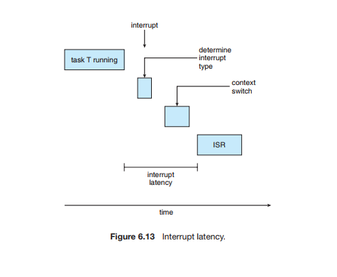
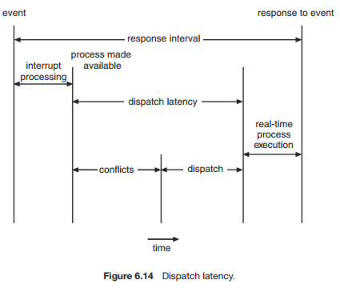

# Systemy Operacyjne :: Lista 12

## Zadanie 6

**Event latency** as the amount of time that elapses from when an event occurs to when it is serviced

Two types of latencies affect the performance of real-time systems:
* Interrupt latency
* Dispatch latency

**Interrupt latency** refers to the period of time from the arrival of an interrupt at the CPU to the start of the routine that services the interrupt. One important factor contributing to interrupt latency is the amount of time interrupts may be disabled while kernel data structures are being updated. Real-time operating systems require that interrupts be disabled for only very short periods of time.

When an interrupt occurs, the operating system must first complete the instruction it is executing and determine the type of interrupt that occurred. It must then save the state of the current process before servicing the interrupt using the specific interrupt service routine (ISR)

**Dispatch latency** is the amount of time required for the scheduling dispatcher to stop one process and start another.

