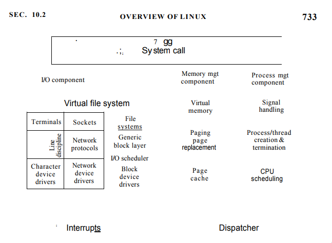
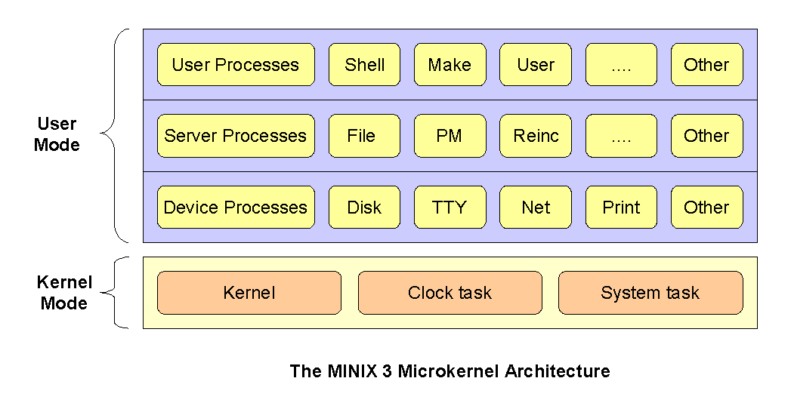

# Systemy operacyjne :: Lista 2

## Zadanie 1

#### fork

* EAGAIN :: limit wątków został przekroczony
* ENOMEM :: brak pamięci
* ENOSYS :: brak wsparcia dla fork

#### waitpid

* ECHILD :: proces nie ma żadnych dzieci, na które musi czekać
* ECHILD :: nie istnieje albo proces podany pidem albo nie jest dzieckiem procesu
wywołującego `waitpid()`

#### lseek

* EBADF :: _fd_ nie jest poprawnym deskryptorem pliku
* EINVTAL :: kiedy _whence_ nie jest prawidłowe
* ENXIO :: kiedy _whence_ jest ustawione na `SEEK_DATA` lub `SEEK_HOLE` i _offset_ wychodzi
poza wielkość pliku
* EOVERFLOW :: offset nie może zostać przedstawiony jako `off_t`
* ESPIPE :: _fd_ jest pipe'm, socketem albo FIFO

#### rename

* EACCES :: brak uprawnień do zapisu
* EBUSY :: któryś z podanych zasobów jest używany przez inny proces albo system
* EDQUOT :: miejsce na dysku dla danego użytkownika zostało wyczerpane
* EFAULT :: któryś z podanych zasobów wskazuje poza dostępną pule adresową (?)
* EISDIR :: `newpath` jest istniejącym katalogiem, ale `oldpath` nie
* ELOOP :: przekroczono ilość skoków po linkach symbolicznych

#### mmap

* EACCES :: deskryptor pliku odwołuje się do niezwyczajnego pliku
* EINVAL :: któryś z podanych argumentów jest nieprawidłowy (np. wielkość nie jest podzielne przez wielkość strony )
* EFILE :: otwarto maksymalną ilość plików narzuconą przez system
* ENOMEM :: brak pamięci
* ENODEV :: system plików nie wspiera mapowania

System komunikuje się z programistą przy użyciu wywołania systemowego `errno`

\pagebreak

## Zadanie 2

```c
stat(const char *pathname, struct stat *statbuf)
```

`userret` wysyła sygnał jeżeli pułapka lub syscall tego chciały. Dodatkowo informuje scheluder o powrocie
z wyjątku dając mu możliwość na np. wywłaszczenie ów procesu.

## Zadanie 3

> Jądro monolityczne – rodzaj jądra systemu operacyjnego, w którym większa część funkcji jądra zaimplementowana jest w pojedynczym obrazie pamięci, który ładowany jest na stałe do pamięci komputera przez bootloader.



---


Podział na warstwy charakteryzuje się tym, że w założeniu wyższa warstwa ma korzystać tylko z warstwy poniżej.
Podstawowym problemem jąder monolitycznych jest już sam fakt, że dużo rzeczy znajduje się w jednym miejscu
co utrudnia debugowanie. Z tego powodu jest mniej bezpieczne niż mikro jądra ( przykład: Windows i Duqu [wirus
wykorzystujący dziurę w rendererze fontów]) Dodatkowo, czyste jądro monolityczne nie jest rozszerzalne inaczej
niż jego ponowną rekompilacje.  Moduły rozwiązują w pewien sposób rozszerzalność jądra a interfejsy typu `FUSE`
pozwalają na pewną abstrakcje wokół elementów działających typowo na poziomie jądra.

## Zadanie 4

> Hardware abstractions are sets of routines in software that emulate some platform-specific details, giving programs direct access to the hardware resources.

> A hardware abstraction layer (HAL) is an abstraction layer, implemented in software, between the physical hardware of a computer and the software that runs on that computer. Its function is to hide differences in hardware from most of the operating system kernel, so that most of the kernel-mode code does not need to be changed to run on systems with different hardware. On a PC, HAL can basically be considered to be the driver for the motherboard and allows instructions from higher level computer languages to communicate with lower level components, but prevents direct access to the hardware.
>
> Operating systems having a defined HAL are easily portable across different hardware. This is especially important for embedded systems that run on dozens of different platforms.

> The device driver is communicates with a specific device at a specific buffer and control flag block location.  A hardware abstraction layer abstracts away the details of how specific devices work.

## Zadanie 5


Motywacje:

* mniejszy codebase
* bezpieczniejsze ( co wynika z argumentu u góry )
* jak najmniej kodu wykonywanego w trybie uprzywilejowanym
* większa responsywność i stabilność

> A distributed operating system is a software over a collection of independent, networked, communicating, and physically separate computational nodes.[1] Each individual node holds a specific software subset of the global aggregate operating system. Each subset is a composite of two distinct service provisioners.

> In computer science, inter-process communication or interprocess communication (IPC) refers specifically to the mechanisms an operating system provides to allow the processes to manage shared data. Typically, applications can use IPC, categorized as clients and servers, where the client requests data and the server responds to client requests.[1] Many applications are both clients and servers, as commonly seen in distributed computing.

> Inter-Process Communication (IPC) is the implementation of general communication, process interaction, and dataflow between threads and/or processes both within a node, and between nodes in a distributed OS. The intra-node and inter-node communication requirements drive low-level IPC design, which is the typical approach to implementing communication functions that support transparency. In this sense, Inter process communication is the greatest underlying concept in the low-level design considerations of a distributed operating system.

## Zadanie 6



> Each driver is carefully monitored by a part of the system named the reincarnation server. If a driver fails to respond to pings from this server, it is shut down and replaced by a fresh copy of the driver.

> At the next level up, there are the device drivers, each one running as a separate userland process. Each one controls some I/O device, such as a disk or printer. The drivers do not have access to the I/O port space and cannot issue I/O instructions directly. Instead, they must make kernel calls giving a list of I/O ports to write to and the values to be written. While there is a small amount of overhead in doing this (typically 500 ns), this scheme makes it possible for the kernel to check authorization, so that, for example, the audio driver cannot write on the disk.

> At the next level there are the servers. This is where nearly all the operating system functionality is located. User processes obtain file service, for example, by sending messages to the file server to open, close, read, and write files. In turn, the file server gets disk I/O performed by sending messages to the disk driver, which controls the disk.

> Routines that provide the runtime kernel environment to programs executing in kernel mode. Kernel extensions call kernel services, which resemble library codes. In contrast, application programs call library routines

## Zadanie 7

> Jądro hybrydowe – jądro systemu operacyjnego oparte na zmodyfikowanych architekturach jądra monolitycznego oraz mikrojądra
> Jądro jest strukturą podobną do mikrojądra, ale zaimplementowaną jak jądro monolityczne. W przeciwieństwie do mikrojądra, wszystkie (lub prawie wszystkie) usługi wykonywane są w przestrzeni jądra. Podobnie jak w jądrze monolitycznym, nie ma strat w wydajności wywołanych przepływem komunikatów mikrojądra i przełączaniem kontekstu między przestrzenią użytkownika a jądra. Jednakże, podobnie jak w jądrach monolitycznych, nie ma korzyści wynikających z umieszczenia usług w przestrzeni użytkownika

> An example of a hybrid kernel design may keep the VFS and bus controllers inside the kernel, but have the file system drivers and storage drivers as user mode programs. 

> Tightly coupled systems tend to exhibit the following developmental characteristics, which are often seen as disadvantages:
>
> * A change in one module usually forces a ripple effect of changes in other modules.
> * Assembly of modules might require more effort and/or time due to the increased inter-module dependency.
> * A particular module might be harder to reuse and/or test because dependent modules must be included.

## Zadanie 8


Hipernadzorca decyduje o tym, które z wirtualizowanych procesów mogą zostać wykonane bezpośrednio na
odpowiednim zasobie sprzętowym, a które powinny zostać wyemulowane.

**Typ 1 :: natywny**

> These hypervisors run directly on the host's hardware to control the hardware and to manage guest operating systems. For this reason, they are sometimes called bare metal hypervisors. The first hypervisors, which IBM developed in the 1960s, were native hypervisors.[4] These included the test software SIMMON and the CP/CMS operating system (the predecessor of IBM's z/VM). Modern equivalents include Xen, Oracle VM Server for SPARC, Oracle VM Server for x86, Microsoft Hyper-V and VMware ESX/ESXi.

**Typ 2 :: programowy**

> These hypervisors run on a conventional operating system (OS) just as other computer programs do. A guest operating system runs as a process on the host. Type-2 hypervisors abstract guest operating systems from the host operating system. VMware Workstation, VMware Player, VirtualBox, Parallels Desktop for Mac and QEMU are examples of type-2 hypervisors.

**SYMULACJA**

> A simulation is a system that behaves similar to something else, but is implemented in an entirely different way. It provides the basic behaviour of a system, but may not necessarily adhere to all of the rules of the system being simulated. It is there to give you an idea about how something works.

**EMULACJA**

> An emulation is a system that behaves exactly like something else, and adheres to all of the rules of the system being emulated. It is effectively a complete replication of another system, right down to being binary compatible with the emulated system's inputs and outputs, but operating in a different environment to the environment of the original emulated system. The rules are fixed, and cannot be changed, or the system fails.
