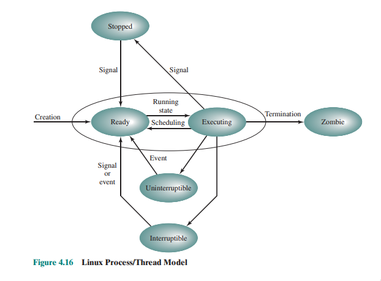

## cheatsheet

`lsof -p PID`  
`ps -eo user,pid,pgid,tid,pri,stat,wchan,cmd,ppid`  
`strace -e trace=WHAT command`  
`strace -c` <- zlicza wywołania  
`strace -p` <- monitorowanie po PID'ie lub TID'ie  
`ls /proc/PID/task` <- lista tid'ów danego procesu
`https://msdn.microsoft.com/en-us/library/windows/desktop/ms682425(v=vs.85).aspx`
`http://undocumented.ntinternals.net/index.html?page=UserMode%2FUndocumented%20Functions%2FNT%20Objects%2FProcess%2FNtCreateProcess.html`

## man

`signal(7)` - lista sygnałów  
`proc(5)` - opis struktury `/proc`  

## quotes

#### Process state

#### Synchronous vs. asynchronous signals

> The occurrence of a signal may be synchronous or asynchronous to the process or thread, depending on the source of the signal and the underlying reason or cause. Synchronous signals occur as a direct result of the executing instruction stream, where an unrecoverable error (such as an illegal instruction or illegal address reference) requires an immediate termination of the process. Such signals are directed to the thread which caused the error with its execution stream. As an error of this type causes a trap into a kernel trap handler, synchronous signals are sometimes referred to as traps.
>
>Asynchronous signals are external to (and in some cases, unrelated to) the current execution context. One obvious example would be the sending of a signal to a process from another process or thread via a kill(2), _lwp_kill(2) or sigsend(2) system call, or a thr_kill(3T), pthread_kill(3T) or sigqueue(3R) library invocation. Asynchronous signals are also aptly referred to as interrupts.

#### Fork & exec

> #### Fork
> * Przydziela pamięć dla struktury zadania procesu potomnego
> * Wypełnia strukturę dziecka danymi rodzica
> * Przydziela pamięc dla stosu i przestrzeni użytkownika
> * Wypełnia przestrzeń danymi rodzica
> * Przydziela PID
> * Określa, że potomek ma wspodzielic tekst z rodzicem
> * Kopiuje tabilce stron dla danych i stosu
> * Określa, że otwarte pliki mają być wspóldzielone
> * Kopiuje rejestry rodzica do dziecka
> #### Exec
> * Odnajduje program wykonywalny
> * Sprawdzenie uprawnien wykonania
> * Odczytuje i weryfikuje nagłówek
> * Kopiuje argumenty i łańcuchy środowiskowe do jądra
> * Zwalnia starą przestrzeń adresową
> * Przydziela nową
> * Kopiuje argumenty i łańcuchy środowiskowe na stos
> * Zeruej sygnały
> * Inicjalizuje rejestry
