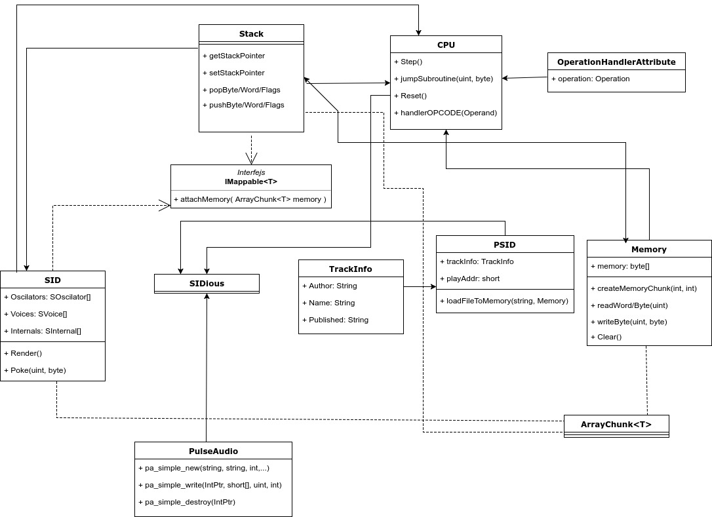

# Opis projektu

## Opis całokształtu

Jest to odtwarzacz plików P-SID a więc program składający się
z niemal pełnej emulacji procesora 6510 oraz modułu interfejsu
dzwiękowego SID odpowiedzialnego za generowanie dzwięku.
Relacje między klasami można więc traktować jak podzespoły
w komputerze: CPU jest głowną jednostką logiczną, ale do generowania
dzwięku potrzebuje odpowiedniego modułu, zatem potrzebuje skorzystać
z implementacji SID. Z drugiej strony i CPU i SID potrzebują mięć
dostęp do pamięci, zatem obydwa moduły mają dostęp do obiektu
klasy Memory. Dodatkowo CPU musi mieć dostęp do stosu, stąd
klasa Stack operująca na obiekcie Memory.

Głównie użytym wzorcem projektowym jest 'Fasada' w którym
budujemy duży obiekt korzystając z mniejszych obiektów i
relacji między nimi, na końcu udostępniając bardziej 
ogólne API to zarządzania nimi.

Napisane przeze mnie klasy można też wykorzystać w inny sposób.
Przykładem może być aplikacja będąca syntezatorem dzwięku korzystająca
z implementacji SID oraz interfejsu MIDI. Innym przykładem może być
zbiór hipotetycznych aplikacji potrzebujących udostępnić kawałek
tablicy. W tym przypadku można użyć klasy ArrayChunk<T>.

## Opis klas

### class SIDious

Głowna klasa programu (MainClass).

### public class ArrayChunk<T>

Klasa implementująca logike pozwalającą na "dzielenie"
tablicy na części. Pozwala to na używanie tej samej tablicy
innym klasą implementujących interfejs IMappable.

### class OperationHandlerAttribute : Attribute

Klasa implementująca niestandardowy atrybut "OperationHandler". 
Ten atrybut jest wykorzystany do opisania metod implementujących
konkretne instrucje assemblera.

### class CPU

Klasa implementująca emulacje procesora MOS 6510 znanego z
Commodore 64. Jest ona podzielona na pare plików CPU.*.cs
przy użyciu 'partial class', co powinno zapewnić lepszą
czytelność kodu.

### public class Memory

Klasa implementująca proste MCU, pozwalająca na zmapowanie
kawałka pamięci i przekazanie go do innego obiektu.

### public class PSID

Klasa implementująca parser plików P-SID. Pozwala także na załadowanie
takiego pliku do pamięci emulatora oraz udostępnia podstawowe informacje
o utworze.

### public class TrackInfo

Klasa przechowywująca informacje o utworze. Wykorzystywana
przez klasę PSID.

### class PulseAudio

Klasa eksportująca funkcje z biblioteki libpulse-simple.

### class SID

Klasa mająca za zadanie obsłużyć emulacje interfejsu dzwiękowego SID
w wersji 6581 znanego z Commodore 64.

### class Stack : IMappable<byte>

Klasa implementująca prosty stos z wykorzystaniem kawałka
pamięci przekazanej w konstruktorze.
