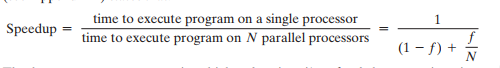
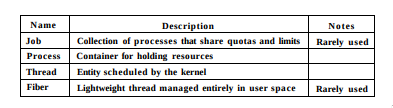

# Systemy Operacyjne :: Lista 4

## Zadanie 1

> *Concurrency* means that two or more calculations happen within the same time frame, and there is usually some sort of dependency between them.
>
> *Parallelism* means that two or more calculations happen simultaneously.

> In computing, a computer program or subroutine is called *reentrant* if it can be interrupted in the middle of its execution, and then be safely called again ("re-entered") before its previous invocations complete execution.

### Czy funkcje wielobieżne są *thread safe*?

Niekoniecznie, przykład:

```c
int global;

void
hehfunc( int *x ) {
    int copy = global;
    global *= 1337;

    *x = global;
    global = copy;
}
```

## Zadanie 2

> * Because kernel has full knowledge of all threads, Scheduler may decide to give more time to a process having large number of threads than process having small number of threads.
> * Kernel-level threads are especially good for applications that frequently block.

## Zadanie 3

> *Scheduler activations* are a threading mechanism that, when implemented in an operating system's process scheduler, provide kernel-level thread functionality with user-level thread flexibility and performance. This mechanism uses a so-called "N:M" strategy that maps some N number of application threads onto some M number of kernel entities, or "virtual processors." This is a compromise between kernel-level ("1:1") and user-level ("N:1") threading. In general, "N:M" threading systems are more complex to implement than either kernel or user threads, because both changes to kernel and user-space code are required.

> *Upcalls* are the interface used by the scheduler activations system in the kernel to inform an application of a scheduling-related event.
>
> * **SA_UPCALL_NEWPROC** This upcall notifies the process of a new processor allocation. The first upcall to a program, triggered by sa_enable(), will be of this type.
> * **SA_UPCALL_PREEMPTED** This upcall notifies the process of a reduction in its processor allocation. There may be multiple ``event'' activations if the allocation was reduced by several processors.
> * **SA_UPCALL_BLOCKED** This upcall notifies the process that an activation has blocked in the kernel. The sa_context field of the event should not be continued until a SA_UPCALL_UNBLOCKED event has been delivered for the same activation.
> * **SA_UPCALL_UNBLOCKED** This upcall notifies the process that an activation which previously blocked (and for which a SA_UPCALL_BLOCKED upcall was delivered) is now ready to be continued.
> * **SA_UPCALL_SIGNAL** This upcall is used to deliver a POSIX-style signal to the process. If the signal is a synchronous trap, then event is 1, and sas[1] points to the activation which triggered the trap. For asynchronous signals, event is 0. The arg parameter points to a siginfo_t structure that describes the signal being delivered.
> * **SA_UPCALL_USER** This upcall is delivered when requested by the process itself with sa_preempt(). The sas[1] activation will be the activation specified in the call.

## Zadanie 5

1. m. in. `fork` tworzy proces jednowątkowy. Dodatkowo, jak wiemy, fork kopiuje pamięć rodzica, a zatem skopiuje informacje o mutex'ach. Jeżeli dany mutex był zablokowany, to zostanie zablokowany już do samego końca. Dodatkowo funkcje standardowe mogą używać jakichś danych globalnych ( oraz wewnętrznych mutex'ów ).

2. > This is slightly nuanced, based on which version of the Linux kernel you are using.
   >
   > Assuming 2.6 posix threads, and if you are talking about the OS sending SIGTERM or SIGHUP, the signal is sent to process, which is received by and handled by root thread. Using POSIX threads, you can also sent SIGTERM to individual threads as well, but I suspect you are asking about what happens when the OS sends the signal to the process.
   > 
   > In 2.6, SIGTERM will cause child threads to exit "cleanly", where as 2.4, child threads were left in an indeterminate state.

## Zadanie 6



> [...] to avoid the dreaded deadlocks and other pitfalls mentioned earlier. To accomplish this, programmer Leonard made use of a technique called lock-free algorithms. He implemented a spin lock to replace the more traditional mutexes (mutual-exclusion algorithms) and semaphores that are used to flag threads as being "safe" to multithread.
>
> Tom examined the threads' activity with profiling tools, and it turned out that 95 percent of the time the threads were reading memory while only spending 5 percent of their time writing. A read/write lock allowed many threads to read the same bit of memory, but only one thread to write to it.

\pagebreak

## Zadanie 8



> A thread normally runs in user mode, but when it makes a system call it
switches to kernel mode and continues to run as the same thread with the same
properties and limits it had in user mode. Each thread has two stacks, one for use
when it is in user-mode and one for use when it is in kernel mode. Whenever a
thread enters the kernel, it switches to the kernel-mode stack. 
