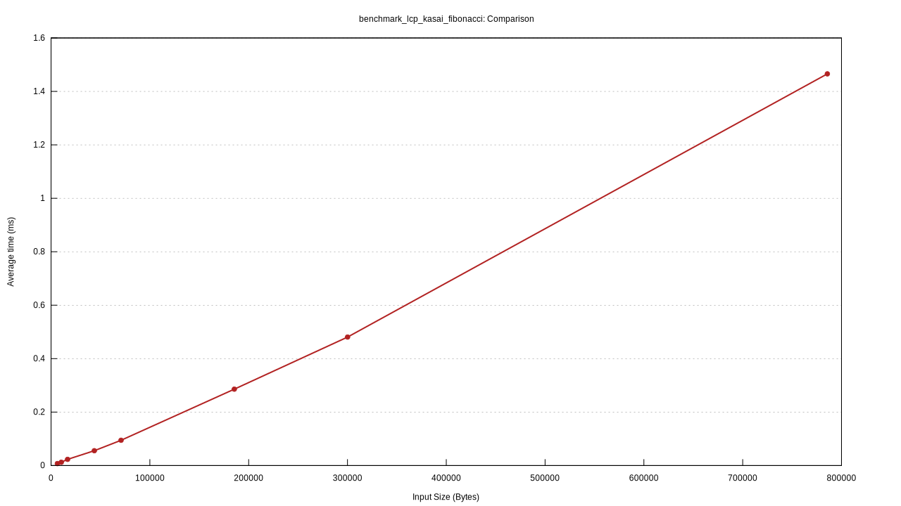

# Wstęp

Oryginalny algorytm autorstwa _Kasai et al._ przedstawiony na wykładzie działa w $\O(n)$ aczkolwiek wykorzystuje średnio $13n$ bajtów pamięci podczas swoich obliczeń. Celem tego projektu była implementacja dwóch wersji algorytmu wykorzystujących odpowiednio $9n$ i $(6 + \delta)n$ pamięci używając trików z [_Two Space Saving Tricksfor Linear Time LCP Array Computation_](https://citeseerx.ist.psu.edu/viewdoc/download?doi=10.1.1.385.9210&rep=rep1&type=pdf). Wytłumaczenie algorytmów można znaleźć w kodzie źródłowym `src/algorithms.rs`.

# Testy

Testy można uruchomić używając komendy `$ cargo test --lib --release`. Zostały one zrealizowane przez
testowanie odpowiedzi między algorytmami przy użyciu $10 000$ losowych słów długości $1000$.

# Benchmarki

## Pamięciowe

Na tekście naturalnym oraz na słowach fibonacciego, algorytm wykorzystujący $(6n + \delta)$ faktycznie jest najlepszy. W przypadku słów losowych mamy natomiast sporo wartości dla których $\text{BWT}[k - 1] \neq \text{BWT}[k],\ k = \text{RSA}[i]$, przez co tablica pomocniczna `ssa` rośnie do sporych rozmiarów w wziązku z czym musimy skopiować prawie całą tablice $\text{SA}$. W każdym jednak przypadku obie implementacje były sporo lepsze niż niemodyfikowany algorytm Kasai-a. Benchmarki można uruchomić samemu korzystając z komendy `$ cargo bench`.

## Złożonościowe

Wszystkie wykresy jak i więcej danych można znaleźć w katalogu `charts`, a dostęp do wszystkich wykresów można uzyskać korzystając z `charts/report/index.html`. Podsumowując, wszystkie algorytmy działają w czasie $\O(n)$, przy czym oryginalny algorytm Kasai-a był najszybszy, następnie $9n$ i algorytm działający w pamięci $(6 + \delta)n$ jest ostatni. Do testowania złożoności zostały użyte słowa losowe oraz słowa fibonacciego odpowiedniej długości.

